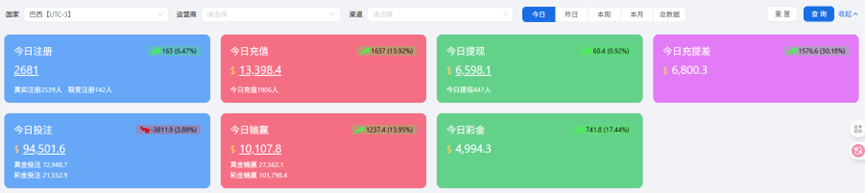

# 仪表盘

#### **数据总览**

<figure><figcaption></figcaption></figure>

**1.功能说明**

仪表盘用于展示平台的核心运营数据，帮助管理者在第一时间掌握整体情况。页面以总览为主，直观反映当前业务的运行状态与趋势

**2.筛选与查询功能**

<figure><figcaption></figcaption></figure>

该功能用于对仪表盘数据进行 条件筛选和时间查询，方便管理者按需查看不同维度的数据表现

2.1渠道筛选

可按国家、运营商、渠道 进行筛选，便于分析不同市场与来源的差异。

2.2时间范围

支持选择今日（选择今日还会显示与昨日的增减趋势）、昨日、本周、本月，快速获取对应周期的数据。

**3.数据说明**

<figure><figcaption></figcaption></figure>

特殊说明1：前缀会根据选择的日期筛选而进行改变，以今日注册为例，选到昨日就变为昨日注册，以下说明都是以今日数据为例

特殊说明2：今日较昨日的变动情况：如下图，只在选择今日数据时会显示，如果今日数据高于昨日数据，则显示绿色向上箭头，表示今日数据高于昨日数据，反之则是红色向下箭头，表示今日数值低于昨日数据，后面所跟的数值为今日-昨日数据的差值，后面所跟的百分比为变化百分比=（今日-昨日差值）/昨日值\*100%

<figure><figcaption></figcaption></figure>

3.1今日注册

<figure><figcaption></figcaption></figure>

（1）今日注册：今日的注册总人数，是真实注册人数和裂变注册人数之和

（2）真实注册：即不包含裂变带来的今日注册人数

（3）裂变注册：即由玩家带来的下级注册人数

3.2今日充值

<figure><figcaption></figcaption></figure>

（1）今日充值：今日的充值金额

（2）今日充值人数：今日的充值总人数

3.3今日提现

<figure><figcaption></figcaption></figure>

（1）今日提现：今日的提现金额

（2）今日提现人数：今日的提现总人数

3.4今日重提差

<figure><figcaption></figcaption></figure>

（1）今日重提差：今日的充值金额-提现金额的差值

3.5今日投注

<figure><figcaption></figcaption></figure>

（1）今日投注：今日的投注金额，包括真金投注和彩金投注

（2）今日投注：今日的真金投注金额

（3）今日投注：今日的彩金投注金额（有彩金的话优先消耗彩金进行投注来完成打码任务）

3.6今日输赢（指平台的盈亏情况）

<figure><figcaption></figcaption></figure>

（1）今日输赢：玩家总投注额-玩家中奖派彩， 正数代表平台盈利（玩家总体输钱），负数代表平台亏损（玩家总体赢钱）

（2）真金输赢：玩家真金总投注额-玩家中奖派彩

（3）彩金输赢：玩家彩金总投注额-玩家中奖派彩

3.7今日彩金

<figure><figcaption></figcaption></figure>

（1）今日彩金：用户获得彩金总金额（除佣金金额以外）

#### 分时数据对比

<figure><figcaption></figcaption></figure>

**1.功能说明**

该功能用于对运营商、渠道的核心数据进行分时段（时间粒度为半小时）对比分析，帮助管理者洞察不同时间段的用户活跃与资金变化情况

**2.筛选与查询**

该功能用于对分时数据进行 条件筛选和时间查询，方便管理者按需查看不同维度的数据表现

2.1渠道筛选

可按国家、运营商、渠道 进行筛选，便于分析不同市场与来源的差异。

2.2用户筛选

可按总用户、新用户、老用户进行筛选，便于分析不同用户类型

2.3指标筛选

可按在线人数、注册人数、充值金额、充值人数、付费率、充值ARPPU（充值金额/充值人数）、活跃ARPU（充值金额/活跃人数）、提现金额进行筛选

2.4时间筛选

可按今天、昨天、最近3天、最近7天、上周、本月、上月、自定义日期（选中单日/日期区间）

#### 热门游戏下注人数分布

<figure><figcaption></figcaption></figure>

**1.功能说明**

该功能用于查看数据总览中筛选出的运营商、渠道的热门游戏下注的人数分布饼状图

**2.厂商选择**

上方可以选择游戏厂商，全部还是单个厂商

#### 游戏品牌下注人数分布

<figure><figcaption></figcaption></figure>

**1.功能说明**

该功能用于查看数据总览中筛选出的运营商、渠道的热门游戏品牌（即PG、Ezugi、Evoplay等游戏）下注的人数分布饼状图

**2.厂商选择**

上方可以选择游戏厂商，全部还是单个厂商
